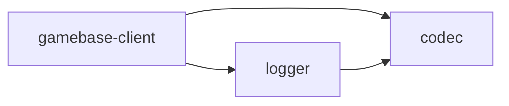

# csharplib

C# reimplementations of the [tslib](https://github.com/yingyeothon/tslib) libraries a
**game client** needs, built to a spec Unity can consume: `netstandard2.0` +
`netstandard2.1`, C# 9, no reflection, no third-party dependencies, and no engine
references in any Runtime assembly.

tslib has twenty packages, but most of them are AWS Lambda, Redis or Node-socket
server code that cannot run on a client at all. These four are the ones that can.

## Packages

| Package | Assembly | Description |
| --- | --- | --- |
| [com.yingyeothon.codec](packages/com.yingyeothon.codec) | `Yingyeothon.Codec` | Dependency-free JSON value tree, parser, writer and codec |
| [com.yingyeothon.logger](packages/com.yingyeothon.logger) | `Yingyeothon.Logger` | Structured logger with a live severity threshold |
| [com.yingyeothon.event-broker](packages/com.yingyeothon.event-broker) | `Yingyeothon.EventBroker` | Type-keyed asynchronous event broker |
| [com.yingyeothon.gamebase-client](packages/com.yingyeothon.gamebase-client) | `Yingyeothon.Gamebase.Client` | Client SDK for the yyt realtime gateway (lobby + dungeon `q`) |



`logger -> codec` is an edge tslib does not have: a structured log context is a
`JsonValue` so a writer can render it without reflection, which IL2CPP's managed
stripper would otherwise break.

## Not ported, and why

`repository` (+ redis/s3/dynamodb), `actor-system` (+ redis/lambda), `lambda-gamebase`,
`gamebase-all-together`, `lambda-authorizer` (+ jwt), `naive-socket`, `naive-redis`,
`logger-slack`, `logger-s3` and `s3-cache-bridge-client` are server libraries: they
need AWS Lambda, the AWS SDK, Redis over raw TCP, or Node's `net`/`tls`. The only
part of them a client needs is the gateway's **wire format**, and that lives in
`gamebase-client`.

## Install

In Unity, _Window → Package Manager → Add package from git URL_. A git-URL package
cannot resolve its own dependencies, so add each one it needs:

```
https://github.com/yingyeothon/csharplib.git?path=/packages/com.yingyeothon.codec
https://github.com/yingyeothon/csharplib.git?path=/packages/com.yingyeothon.logger
https://github.com/yingyeothon/csharplib.git?path=/packages/com.yingyeothon.gamebase-client
```

Unity generates the `.meta` files on import; they are not committed here.

## Development

Requires the .NET 8 SDK. Unity is not needed to build or test.

```bash
dotnet build Yingyeothon.sln -c Release        # netstandard2.0 + 2.1, warnings as errors
dotnet format Yingyeothon.sln --verify-no-changes
dotnet test  Yingyeothon.sln -c Release        # NUnit 3, the version Unity ships
./scripts/validate-packages.sh                 # structural checks Unity cares about
```

Each package is a UPM package **and** a pair of `.csproj` files over the same
sources: `Runtime/` builds the library, `Tests/` builds the test assembly, and
`Runtime/Unity/` is excluded from the dotnet build so it can reference the engine.
Build output goes to `artifacts/` so no `bin/` or `obj/` ever appears where Unity
would import it.

API design rules are in [CONVENTIONS.md](CONVENTIONS.md); durable lessons are in
[rules/](rules/index.md).
