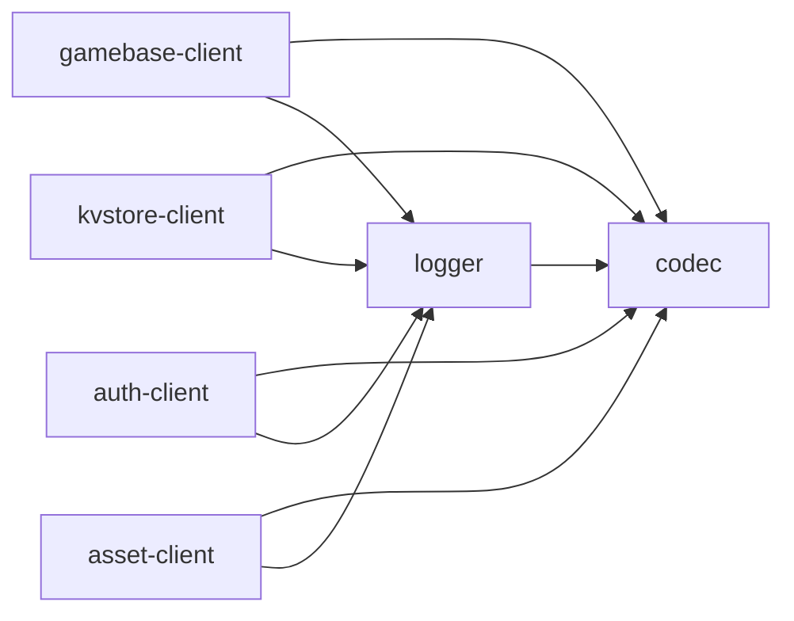

# csharplib

The client libraries for the **yyt platform**: point them at the channels you
provisioned in the [yyt console](https://console.yyt.life/ui/) and a Unity game is
talking to the realtime gateway — positions, chat, parties, and a dungeon run against
your own game actor.

Built to a spec Unity can consume: `netstandard2.0` + `netstandard2.1`, C# 9, no
reflection, no third-party dependencies, and no engine references in any Runtime
assembly, so Mono and IL2CPP both compile it.

```csharp
var lobby = GatewayLobbyClient.Create(new GatewayLobbyClientOptions
{
    Url = "wss://gw.yyt.life",          // the channel's wsUrl, origin only
    ChannelId = "lobby_0123456789ab",   // from the console
    Token = channelJwt,                 // from your auth channel
});

Hello hello = await lobby.ConnectAsync();
lobby.Pos(hello.Zone, x, y, "n");
void Update() => lobby.Poll();          // or nothing happens
```

## Documentation

**[Start here](docs/README.md)** — the guide is written to be enough on its own.

| | |
| --- | --- |
| [Getting started](docs/getting-started.md) | empty Unity project to a connected, moving client |
| [Console and options](docs/console-and-options.md) | what the console hands you, and every option |
| [Authentication](docs/authentication.md) | how a client gets its channel JWT, with `auth-client` |
| [Lobby](docs/lobby.md) / [Dungeon](docs/dungeon.md) | the two channel kinds, feature by feature |
| [Errors](docs/errors.md) / [Troubleshooting](docs/troubleshooting.md) | every refusal, close code and symptom |
| [Key-value store](docs/kvstore.md) | announcements and a player's own record, with the same token |
| [Asset bundles](docs/assets.md) | files the game ships beside its build, encrypted or not |
| [API reference](docs/api/) | generated from the assemblies, gated in CI |

## Packages

| Package | Assembly | Description |
| --- | --- | --- |
| [com.yingyeothon.codec](packages/com.yingyeothon.codec) | `Yingyeothon.Codec` | Dependency-free JSON value tree, parser, writer and codec |
| [com.yingyeothon.logger](packages/com.yingyeothon.logger) | `Yingyeothon.Logger` | Structured logger with a live severity threshold |
| [com.yingyeothon.event-broker](packages/com.yingyeothon.event-broker) | `Yingyeothon.EventBroker` | Type-keyed asynchronous event broker |
| [com.yingyeothon.gamebase-client](packages/com.yingyeothon.gamebase-client) | `Yingyeothon.Gamebase.Client` | Client SDK for the yyt realtime gateway (lobby + dungeon `q`) |
| [com.yingyeothon.kvstore-client](packages/com.yingyeothon.kvstore-client) | `Yingyeothon.KvStore` | Client for the yyt key-value store (`doc.yyt.life/kv/*`) |
| [com.yingyeothon.auth-client](packages/com.yingyeothon.auth-client) | `Yingyeothon.Auth` | Client for a yyt auth channel: sign-in URL, redirect, exchange, verify |
| [com.yingyeothon.asset-client](packages/com.yingyeothon.asset-client) | `Yingyeothon.Assets` | Reader for yyt asset bundles on the CDN, decrypting `yyt-enc v1` |


```mermaid
graph LR
  gamebase-client --> codec
  gamebase-client --> logger
  kvstore-client --> codec
  kvstore-client --> logger
  auth-client --> codec
  auth-client --> logger
  asset-client --> codec
  asset-client --> logger
  logger --> codec
```

`logger -> codec` is an edge tslib does not have: a structured log context is a
`JsonValue` so a writer can render it without reflection, which IL2CPP's managed
stripper would otherwise break.

## Ported from tslib

Five of them are C# reimplementations of the
[tslib](https://github.com/yingyeothon/tslib) packages a game client can use. tslib has
twenty; most are AWS Lambda, Redis or Node-socket server code that cannot run on a
client at all. `auth-client` has no tslib counterpart — tslib's authorizers are the
server half — and follows flutterlib's `yingyeothon_auth_client` instead; `asset-client`
ports tslib's newer `@yingyeothon/asset-client`, which came with the platform's
encrypted bundles.

There is deliberately no client for the per-player document store (`/s/*`): its writes
take the auth channel's doc apiKey, which a game must never hold. State a player writes
itself goes in a `user`-scoped [key-value](docs/kvstore.md) collection.

## Not ported, and why

`repository` (+ redis/s3/dynamodb), `actor-system` (+ redis/lambda), `lambda-gamebase`,
`gamebase-all-together`, `lambda-authorizer` (+ jwt), `naive-socket`, `naive-redis`,
`logger-slack`, `logger-s3` and `s3-cache-bridge-client` are server libraries: they
need AWS Lambda, the AWS SDK, Redis over raw TCP, or Node's `net`/`tls`. The only
part of them a client needs is the gateway's **wire format**, and that lives in
`gamebase-client`.

## Install

In Unity, _Window → Package Manager → Add package from git URL_. A git-URL package
cannot resolve its own dependencies, so add each one it needs:

```
https://github.com/yingyeothon/csharplib.git?path=/packages/com.yingyeothon.codec#v0.1.0
https://github.com/yingyeothon/csharplib.git?path=/packages/com.yingyeothon.logger#v0.1.0
https://github.com/yingyeothon/csharplib.git?path=/packages/com.yingyeothon.gamebase-client#v0.1.0
```

`com.yingyeothon.kvstore-client`, `com.yingyeothon.auth-client` and
`com.yingyeothon.asset-client` sit on the same two dependencies and are independent of
`gamebase-client` and of each other;
`com.yingyeothon.event-broker` is independent of all of them. Add any of them the same
way if you want it:

```
https://github.com/yingyeothon/csharplib.git?path=/packages/com.yingyeothon.kvstore-client#v0.1.0
https://github.com/yingyeothon/csharplib.git?path=/packages/com.yingyeothon.auth-client#v0.1.0
https://github.com/yingyeothon/csharplib.git?path=/packages/com.yingyeothon.asset-client#v0.1.0
https://github.com/yingyeothon/csharplib.git?path=/packages/com.yingyeothon.event-broker#v0.1.0
```

These URLs pin a release tag; move every one of them together to take another, and drop
the fragment only if you mean to track `main`. Every asset carries its committed `.meta`,
which is what lets a git-URL install compile at all. Each package ships importable
`Samples~`. [docs/unity.md](docs/unity.md) has the details.

## Development

Requires the .NET 8 SDK. Unity is not needed to build or test.

```bash
dotnet build Yingyeothon.sln -c Release        # netstandard2.0 + 2.1, warnings as errors
dotnet format Yingyeothon.sln --verify-no-changes
dotnet test  Yingyeothon.sln -c Release        # NUnit 3, the version Unity ships
./scripts/check-coverage.sh                    # per-package floor: line 80 / branch 70
./scripts/validate-packages.sh                 # structural checks Unity cares about
./scripts/unity-meta.sh --write                # a .meta for each new file under packages/
```

The first `dotnet build` also points git at `scripts/git-hooks`
(`./scripts/install-git-hooks.sh` does it on its own if you would rather not build).
This repository is public, so those hooks refuse a commit that carries build output,
a Unity `.meta` outside `packages/`, a package asset without its `.meta`, or anything
credential-shaped, and run [gitleaks][] on the staged diff — install it, or every
commit is refused. CI runs the same scan over the whole
history. See [rules/security.md](rules/security.md).

[gitleaks]: https://github.com/gitleaks/gitleaks

Each package is a UPM package **and** a pair of `.csproj` files over the same
sources: `Runtime/` builds the library, `Tests/` builds the test assembly, and
`Runtime/Unity/` is excluded from the dotnet build so it can reference the engine.
Build output goes to `artifacts/` so no `bin/` or `obj/` ever appears where Unity
would import it.

API design rules are in [CONVENTIONS.md](CONVENTIONS.md); durable lessons are in
[rules/](rules/index.md).

Unity itself is verified before a release, not on every change: the same package tests
run inside the editor on the 2021.3 floor and on Unity 6, and both scripting backends
build and run a player. [rules/manual-verification.md](rules/manual-verification.md)
has the recipe and what it last proved.

## License

MIT — see [LICENSE](LICENSE).
