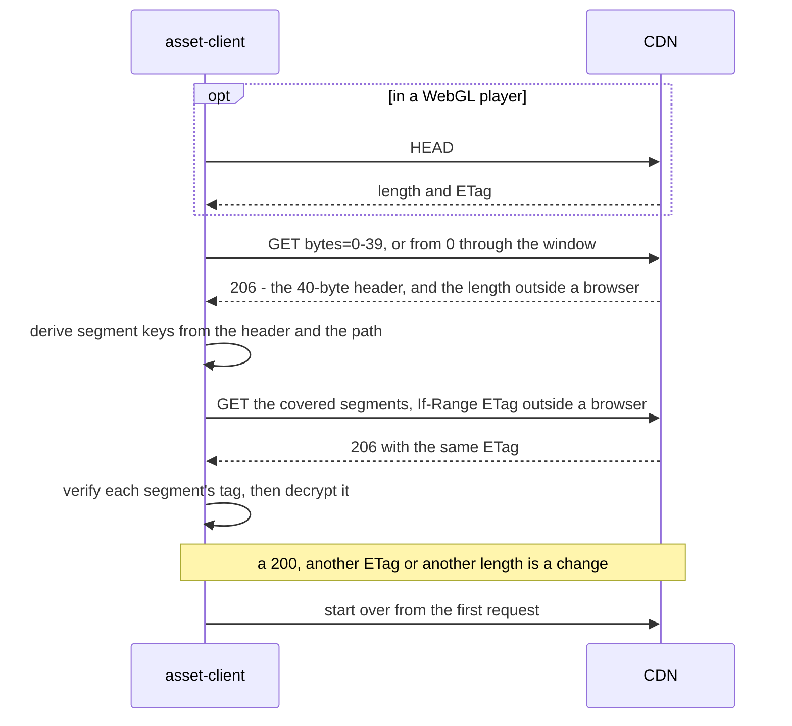

# Asset bundles

Files a game ships beside its build rather than in it: a SQLite database, music, a level
pack, and the manifest that names them. This page owns how a game lays out and reads a
bundle with `asset-client`. Creating bundles, `yyt asset sync`, the key and the CDN's
cache rules belong to the [`service`](https://github.com/yingyeothon/service)
repository (`docs/decisions.md` _Live and encrypted asset bundles_ and
`docs/asset-encryption.md` there).

**Reference:** [`Yingyeothon.Assets`](../packages/com.yingyeothon.asset-client/README.md)
carries the install URL, the options, the request count of every call, the browser
rules, the file download and every error code.

## Bundle shapes

A bundle is created once, with `yyt asset create <name> --mode live` (or `versioned`,
the default) and optionally `--encrypted`. Neither choice can be changed later, and
together they decide how a game reads the bundle.

| Choice | Values | What the client does with it |
| --- | --- | --- |
| `mode` | `versioned`, `live` | `BaseUrl` ends in `/{bundleId}/{version}/` or in `/{bundleId}/`; your build picks the version to read |
| `encrypted` | off, on (a `yak1.` key) | without `Key` the client returns the bytes as served; with it, it verifies and decrypts them, same calls |

`yyt asset files <bundle>` prints each file's public URL, which is where the bundle id
and the CDN host of `BaseUrl` come from, and `yyt asset key show <bundle>` prints an
encrypted bundle's key.

**The key is inside every copy of your game.** Encryption keeps the bundle from someone
who finds a CDN URL, which a plain bundle never did; it does not keep it from your
players, and a leaked key means a new bundle and a new release. Treat it like any other
string your build ships, and never log it.

## The manifest pattern

Inside a live bundle each file is immutable (served for a year; its path only ever
accepts the same bytes again) or mutable (served `no-cache`, small, meant for a
manifest). The usual layout is one mutable manifest naming immutable files by content,
uploaded with `yyt asset sync <bundle> <dir> --mutable manifest.json`. A release then
replaces the manifest and nothing else, and no CDN invalidation is ever needed:

```csharp
using Yingyeothon.Assets;

// kept in a field for as long as the game reads the bundle; Dispose() when done
var bundle = AssetBundleClient.Create(new AssetBundleClientOptions
{
    BaseUrl = "https://d.yyt.life/assets/ab_0123456789abcdef/",   // dev: https://dev-d.yyt.life
    Key = bundleKey,                                              // omitted for a plain bundle
});

// the manifest revalidates on every read; the files it names never change
var manifest = await bundle.ReadJsonAsync("manifest.json");
var db = await bundle.ReadAsync(manifest.GetString("db")!);          // e.g. "data/songs-3f9a.db"
```

`sync` uploads the immutable files before the manifest, so a manifest never names a file
that is not there yet. **The console's path rule is what a bundle can hold**: up to eight
`/`-separated segments, each starting with an ASCII letter or digit and then up to 63
more of letters, digits, space, `.`, `_` and `-`, at most 200 characters in all
(`services/console/src/assets.ts` in the `service` repository). The client itself reads
any path the format allows, non-ASCII included.

`--encrypted` and `yyt asset key show` need a `yyt` CLI of `v0.12.0` or later.

A large file goes to disk rather than memory, and resumes where it stopped:

```csharp
var path = Path.Combine(Application.persistentDataPath, "album.ogg");
await AssetFiles.DownloadToFileAsync(bundle, manifest.GetString("album")!, path,
    p => progress = p.Total.HasValue ? (float)p.Written / p.Total.Value : 0);
```

**The file on disk is plaintext.** Put it in the app's private storage, and delete the
`.part` and `.part.etag` files beside it to give up on a download.

## A ranged read, and what happens when the file changes

`ReadAsync` is one `GET` of the whole file. `ReadRangeAsync`, and any download of an
encrypted file, cannot trust one answer to describe the object the next answer comes
from, because a mutable file can be replaced between them. So the client records the
object's identity first and checks every later answer against it:



A window that starts in the first segment folds the header and the segments into one
request. The segment keys depend on the path, which is why a file served under another
path fails its first tag rather than decrypting to garbage. Starting over is bounded;
the package README gives the count and the error after it.

## On Unity

- **WebGL.** `HttpClient` cannot send there: pass
  `AssetUnityWebRequestTransport.Instance` as `Transport`. The client switches to
  CORS-safe requests on its own in a WebGL player (not in the editor's Play mode),
  because the CDN exposes only `ETag` and `Content-Length` to a page and refuses a
  preflight. The Unity transport buffers each answer whole, as a browser does, so a
  download there holds the whole file and `ResponseTimeout` must cover its whole
  transfer. **The Unity side — WebGL included — has not been run yet**; see the package
  README.
- **Threads.** Calls may start on any thread with the default transport, and the
  `UnityWebRequest` one needs the main thread; a task — and a download's progress
  callback — resumes on your synchronization context either way, so start them on the
  main thread to touch the scene from them.
- **IL2CPP.** The package's `link.xml` keeps it whole, like the other clients'.

## Errors

What each code means is the package README's
([Errors](../packages/com.yingyeothon.asset-client/README.md#errors)); this is why a game
usually meets it:

| `Code` | Why you would hit this |
| --- | --- |
| `bad_key` | the key was pasted with a character missing or added, or it is some other secret |
| `not_found` | a typo in the path or the bundle id, a file not synced yet, or a version that does not exist — the CDN says 403 |
| `asset_corrupt` | the wrong key, a `BaseUrl` naming another version or a folder, a file `yyt asset sync` did not upload, or a manifest that is not JSON |
| `http` | a proxy that ignores `Range`, a server error, or a file replaced on every attempt of one read |
| `network` | offline, or the connection dropped or went quiet mid-body; a download can resume from what it already wrote |

`asset_corrupt` is never worth retrying: the bytes will verify the same way the next
time. Check the key and the `BaseUrl` first.

Next: [Key-value store](kvstore.md) is the other half of what a game reads from the
platform — small records that change while the game runs, rather than files that change
when you release.
